<!-- ═══════════════════════════════════════════════════════════════
     DAKSH SHINDE — GITHUB PROFILE · "NIGHT RAMEN" EDITION
     hand-drawn animated SVG art · warm lofi palette · ffb56b / ff7a3c

     HOW TO USE (one drag & drop):
     upload these 6 files together to the Dakshinde130/Dakshinde130 repo:
       README.md (this file) · hero-banner.svg · now-playing.svg
       stats-ribbon.svg · quote-card.svg · contact-banner.svg
═══════════════════════════════════════════════════════════════ -->

<!-- OPTIONAL EXTRA BANNER: already have banner.gif in this repo?
     Move the img line below OUT of this comment and it goes live above the art.

  

-->

<!-- ══════════ HAND-DRAWN ANIMATED HERO ══════════ -->

  

<!-- ══════════ TYPING LINE ══════════ -->

  

 

  
  &nbsp;
  

  

## 🌙 About Me

*good to have you here.* ☕

- 🎓 **B.Tech CS + Data Science Minor** @ SGGS Institute, Nanded *(2023–2027)*
- 🤖 I build with **AI & ML** — and I care that it actually works, not just demos well
- 📈 Obsessed with **algorithmic trading, markets & quantitative finance**
- ☁️ Currently diving deep into **AI engineering, cloud & quant strategies**
- 🤝 Open to collab on **AI apps, fintech projects & open source**
- 💬 Ask me about **Bayesian inference, anime, trading — or literally anything CS**
- 🎯 Goal: **a job or internship where I build real things with a real team**
- ⚡ Fun fact: built a mind-reading anime guessing game using pure probability math — **and it works**

 

  

 

### 🔗 Find Me Around

  
  &nbsp;&nbsp;&nbsp;
  
  &nbsp;&nbsp;&nbsp;
  
    
  

 

### 🌱 Right Now I'm…

- Finalising **AniKator** and **SmartStyle AI** — pushing full repos live soon
- Going deeper on **AI engineering** — building systems meant for production, not demos
- Studying **algorithmic trading strategies**, pairs trading & market microstructure
- Looking for **internships & full-time roles** in AI/ML or full-stack
- Always up for a good conversation — reach out anytime ✨

 

  

  

## 🍜 The Toolbox

<table>
<tr>
  <td align="center" width="110">
     <b>Python</b>
  </td>
  <td align="center" width="110">
     <b>JavaScript</b>
  </td>
  <td align="center" width="110">
     <b>Java</b>
  </td>
  <td align="center" width="110">
     <b>C</b>
  </td>
  <td align="center" width="110">
     <b>React</b>
  </td>
  <td align="center" width="110">
     <b>Supabase</b>
  </td>
  <td align="center" width="110">
     <b>MySQL</b>
  </td>
</tr>
<tr>
  <td align="center" width="110">
     <b>Git</b>
  </td>
  <td align="center" width="110">
     <b>GitHub</b>
  </td>
  <td align="center" width="110">
     <b>VS Code</b>
  </td>
  <td align="center" width="110">
     <b>Postman</b>
  </td>
  <td align="center" width="110">
     <b>HTML5</b>
  </td>
  <td align="center" width="110">
     <b>CSS</b>
  </td>
  <td align="center" width="110">
     <b>Linux</b>
  </td>
</tr>
<tr>
  <td align="center" width="110">
     <b>NumPy</b>
  </td>
  <td align="center" width="110">
     <b>Scikit-Learn</b>
  </td>
  <td align="center" width="110">
     <b>OpenCV</b>
  </td>
  <td align="center" width="110">
     <b>Pandas</b>
  </td>
  <td align="center" width="110">
     <b>Streamlit</b>
  </td>
  <td align="center" width="110">
     <b>Ollama</b>
  </td>
  <td align="center" width="110">
     <b>GCP</b>
  </td>
</tr>
</table>

  

## ⚡ Things I've Built

*seven projects — quant tools, AI apps and full-stack builds. strongest first.* 🌟

 

### 🎲 Monte Carlo Trading Simulator — *A Thousand Futures for Every Stock*

> **"Markets are random. So I simulated a thousand versions of tomorrow — and stress-tested every strategy against all of them."**

<table>
<tr>
<td width="65%">

An **8-page Streamlit quant lab** that generates **1,000+ price paths** per asset across **7 stochastic models**, then backtests strategies and scores their risk the way a real trading desk would. This is the project that taught me how serious quant tooling is actually built.

**What's under the hood:**

- **7 stochastic engines** — GBM, Heston, Merton-jump, Kou, regime-switching, Student-t & historical bootstrap
- **9 strategies** backtested with VaR, CVaR, Sharpe & Sortino
- Efficient frontier + **Black–Scholes** options pricing
- **83 pytest tests** guarding every number

</td>
<td width="35%" align="center">

</td>
</tr>
</table>

---

### 📊 TradeSim Pro — *Backtest Three Years in Three Seconds*

> **"Upload a Python strategy. Watch it trade real market history on charts that look like a trading terminal."**

<table>
<tr>
<td width="35%" align="center">

</td>
<td width="65%">

A **full-stack strategy backtester**: a Python engine feeds **real Yahoo Finance OHLCV** into a dark-theme JavaScript front-end built to feel like a pro trading desk. Bring your own strategy, hit run, read the results like a quant.

**The toolkit:**

- Candlestick charts, equity curves & a **monthly P&L heatmap**
- Parameter optimizer + P&L distribution analysis
- Drop in your **own Python strategy file**
- US & Indian markets, with offline simulated-data fallback

</td>
</tr>
</table>

---

### 📡 Trading AI — *Your TradingView Chart, Read by a Machine*

> **"It watches the symbol you're on and hands back a full trade plan — entry, stops, targets, conviction."**

<table>
<tr>
<td width="65%">

A **Firefox extension wired to a Python backend** that reads live TradingView symbols and returns multi-timeframe trading signals across **10 timeframes** — for crypto, forex, and Indian equities. Market-structure analysis, automated.

**What it spots:**

- Auto-detected **order blocks** & support/resistance zones
- **NIFTY 50 + India VIX** market-bias read
- Confluence trade plan: **Entry, SL, TP1–TP3 + conviction score**
- Works across crypto, forex & Indian stocks

</td>
<td width="35%" align="center">

</td>
</tr>
</table>

---

### 🎯 AniKator — *The AI That Can Read Your Mind*

> **"Think of any anime character. I'll figure out who you picked."**

<table>
<tr>
<td width="35%" align="center">

</td>
<td width="65%">

An **Akinator-style guessing game** for anime fans, powered by **Bayesian inference** and **decision trees**. Think of a character from a pool of **1,000+** — AniKator asks targeted yes/no questions and narrows down the answer with probability math, not brute force.

Every question it asks is the *statistically optimal* one — the one that eliminates the most possibilities at once.

**What makes it different:**

- Pure math, no hardcoded logic trees
- 1,000+ characters across genres and eras
- Optimized question flow — finds the answer fast
- Built entirely solo, from dataset to UI

</td>
</tr>
</table>

---

### 👗 SmartStyle AI — *Your Family's AI Fashion Assistant*

> **"Never stare at your wardrobe wondering what to wear again."**

<table>
<tr>
<td width="65%">

A **full-stack AI wardrobe app** that uses **computer vision** to recognize clothing, then suggests outfits by occasion and preference — for one person, a couple, or a whole family under one account.

Secure **OTP login via Supabase** — no passwords to remember, no security compromises. Cloud backend, so your wardrobe goes wherever you do.

**What it solves:**

- Knows what you own, even when you forget
- CV-powered item recognition — snap and save
- Multi-user support for families
- Secure OTP auth, zero password friction

</td>
<td width="35%" align="center">

</td>
</tr>
</table>

---

### 🔄 SkillSwap — *The Student Knowledge Exchange*

> **"You know something I don't. I know something you don't. Let's trade."**

<table>
<tr>
<td width="35%" align="center">

</td>
<td width="65%">

A **peer-to-peer learning platform** built on a simple but powerful idea: college students are massively underutilized as teachers. Post a skill you can teach, browse skills you want to learn, and connect — no money, no tutors, just students helping students.

**The vision:**

- Skill barter — teach one, learn one
- Built for and by students
- Fast Streamlit interface, clean Pandas backend
- Designed to scale to any campus

</td>
</tr>
</table>

---

### 🍳 Recipe Generator — *Ingredients In, Dinner Out*

> **"Tell it what's in your fridge. It figures out the rest."**

<table>
<tr>
<td width="65%">

A **Java-based recipe discovery app** that takes what you have — ingredients, dietary preferences, or a craving — and returns recipes via live API calls. The focus: genuinely **clean, extensible OOP code**. Every component modular, every method doing one thing well.

**The engineering:**

- Java with clean OOP architecture
- Live recipe API integration
- Modular design — easy to extend or repurpose
- Written to be readable, not just functional

</td>
<td width="35%" align="center">

</td>
</tr>
</table>

  

## 💼 Where I've Worked

*two internships, two different worlds — capital markets and search. both taught me how real teams actually ship.*

 

### 📈 Finance & Stock Market Intern-Trainee — *CertiWise Hub* · June 2026

> **"Learning how capital actually moves — from portfolio theory to the trade ticket."**

<table>
<tr>
<td width="65%">

Hands-on immersion in **financial & investment markets** — the mechanics behind mutual funds, NPS, fixed deposits, and tax-saving instruments, plus the **portfolio & risk management** thinking that ties them all together.

**On the desk:**

- Exposure across **mutual funds, NPS, FDs & tax-saving instruments** plus core portfolio & risk concepts
- Built a personal **Investment Policy Statement (IPS)** with structured stock-selection criteria
- **Performance tracking** — analysed campaign metrics as part of a structured evaluation

</td>
<td width="35%" align="center">

</td>
</tr>
</table>

---

### 🔍 SEO Intern — *Godecor Technologies Pvt Ltd* · Sept–Oct 2024

> **"Made pages findable — keyword research, audits, and the backlinks that actually move rankings."**

<table>
<tr>
<td width="35%" align="center">

</td>
<td width="65%">

Worked the **search-visibility** side of digital growth: research, audits, and optimisation aimed at lifting organic reach across the company's digital assets.

**What I did:**

- Ran **keyword research, on-page optimisation & SEO audits** to grow search visibility and organic reach
- Analysed **website performance metrics**, built high-quality backlinks & drove outreach initiatives
- Stayed current on evolving SEO trends through ongoing team discussions

</td>
</tr>
</table>

  

## 📊 GitHub, In Numbers

*commits compound — just like returns.* 📈

 

  

  

  

  

## 🎓 Certifications & Courses

| Certification | Issuer |
|---|---|
| Oracle Cloud Infrastructure 2025 AI Foundations Associate | **Oracle** |
| Oracle Cloud Infrastructure 2025 Generative AI Professional | **Oracle** |
| Trading Strategies in Emerging Markets | **Indian School of Business** |
| Machine Learning for All | **University of London** |
| Python & Statistics for Financial Analysis | **HKUST** |
| Data Structures & Algorithms Specialization | **UC San Diego** |
| Using Python to Access Web Data | **University of Michigan** |
| Python Data Structures | **University of Michigan** |
| Retrieving, Processing & Visualizing Data with Python | **University of Michigan** |
| Claude AI Fluency & Prompt Engineering | **Anthropic** |
| Smart India Hackathon Participant | **Government of India** |

  

## 🎪 Three Years of Pragyaa

*three years. three roles. one fest that taught me how to actually get things done.*

| Year | Role | Level |
|:---:|---|:---:|
| 2025–26 | **Hospitality & Guest Management Lead** | 👑 Lead |
| 2024–25 | Joint Coordinator, Public Relations | 🚀 Growth |
| 2023–24 | Hospitality Trainee | 🌱 Start |

Ran operations for **Pragyaa**, SGGS's flagship annual tech & culture fest drawing **2,000+ student participants**. Led teams, managed VIP guests, coordinated sponsorship, PR and logistics simultaneously — and kept calm when everything was on fire. Three years of building the muscle to get things done under pressure.

  

## 💌 Let's Talk

  

&nbsp;

&nbsp;

&nbsp;

&nbsp;

 

  

<!-- ═══════════════════════════════════════════════════════════════
     OPTIONAL UPGRADE — CONTRIBUTION SNAKE (2 minutes, one time):
     1. In this repo: Actions tab, "set up a workflow yourself", paste:

        name: generate snake
        on:
          schedule:
            - cron: "0 0 * * *"
          workflow_dispatch:
        permissions:
          contents: write
        jobs:
          build:
            runs-on: ubuntu-latest
            steps:
              - uses: Platane/snk/svg-only@v3
                with:
                  github_user_name: Dakshinde130
                  outputs: dist/snake.svg?palette=github-dark
              - uses: crazy-max/ghaction-github-pages@v4
                with:
                  target_branch: output
                  build_dir: dist
                env:
                  GITHUB_TOKEN: ${{ secrets.GITHUB_TOKEN }}

     2. Run it once from the Actions tab, then add this line anywhere:
        
═══════════════════════════════════════════════════════════════ -->

<!-- you found the hidden comment. that's very you. 🍜
     go build something cool — or come say hi: dakshinde007@gmail.com -->
